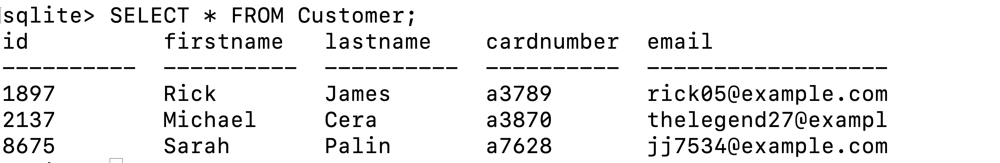

# Managing Data Access: Using Views to Encapsulate Data

In this tutorial, you will learn how the _VIEW_ command can be used to give users access to only the data they are allowed to see. This process increases database security by encapsulating data with _Need to Know_ access.

This is a beginner level tutorial, but we do assume that you are already familiar with how a sqlite database works, as well as how to use SELECT and JOINS. All examples of commands are designed to be copy and pasted directly into your command line so that you can have the same database and settings we used. 

## Does Encapsulation Matter?

If you are creating a database for a company, should every employee have write access to the entire database? Of course not, that is just an invitation for someone to mistakenly change one table and ruin everything! But what about read access? What harm could come from every employee being able to at least see all of the information that is stored? While threats from hackers makes big news, data security is most often compromised by internal actors.

## Case Study: Private(Pvt) Bradley "Chelsea" Manning

The case of Pvt  Manning is a good example of why encapsulation is important. Manning was an intelligence analyst with the US Army who possessed a Top Secret clearance with SCI access. The SCI portion means that they had access to _Sensitive-Compartmentalized Information_, the Department of Defense's (DOD) method of data encapsulation for over 50 years. In 2010, Manning used their legitimate database permissions to retrieve over half a million intelligence records and released them to WikiLeaks. Because of the compartmentalized nature of DOD security clearances and access programs, Manning should not have had access to the vast majority of those records.


What is so interesting is that even though the DOD has data encapsulation built into their security clearances, that same level of encapsulation was never applied to the databases that stored the information. So how can we apply the lessons learned by the US Government to solve our own security issues? The solution is something called **Views**

## What Is A View?

A view may be a subset of the database or it may contain virtual data that is derived from the database files but is not explicitly stored.So a view is what the user is able to see from the stored records. In the case we talked about earlier, a view can be used to restrict what data a user can access for security reasons. But there are also more mundane uses of views. For example, having to sort through too much data can lead to a loss of productivity because the user has to process all extraneous information that was returned. 
   

Let's start with something simple: we have a table `customer`, which stores useful information about the customers of our hypothetical company.  Some columns of this table include `id`, `firstname`, `lastname`, `cardnumber`, and `email`.

Let's go ahead and create this table and insert some records:

```sql
DROP TABLE IF EXISTS Customer;

CREATE TABLE Customer(id integer, firstname text, lastname text, cardnumber text, email text);

INSERT INTO Customer VALUES(1897, 'Rick', 'James', 'a3789', 'rick05@example.com');
INSERT INTO customer VALUES(2137, 'Michael', 'Cera', 'a3870', 'thelegend27@example.com');
INSERT INTO customer VALUES(8675, 'Sarah', 'Palin', 'a7628', 'jj7534@example.com');

.mode column
.headers on
```

Let’s try running a basic query to see if everything is working

```sql
SELECT * FROM Customer;
```
You should see this output:


We have different systems that access this table.  For example, accounts payable would need to see all of this information to handle billing. Now let's say that we have an email info letter that we send once a month to all of our customers informing them of all the cool new features in our product.  Would this system need access to `cardnumber`?  No, and giving it access would create a larger attack surface and the possibility that one could divulge sensitive information on accident, and if computer scientists are known for anything, it's making mistakes.

## Controlling Per-Column Access

Let's say that the emailer only needs access to the `firstname`and `email` columns of the customer table to add a bit of personalization to emails that it sends.  In SQLite syntax, we can create a view to accomplish this like so:

```sql
CREATE VIEW emailer_customer AS SELECT firstname, email FROM customer;
```

Because a view is effectively a select mask on an already existing table, the syntax for creating one is fairly straightforward.  We only need to include the columns that we want to expose in the select subquery.

We can now query the view like we would any other table, for example:

```sql
SELECT * FROM emailer_customer;  
```


Notice that even though we are using `SELECT *`, only two columns are being fetched.  This is because `emailer_customer` is only exposing two columns - `firstname` and `email` - from the underlying table `customer`.

You can also list all views that have been created on your database with:
```sql
SELECT name FROM sqlite_master WHERE type = 'view'
```

Let's pull back the curtains and see what's going on with the above query when the DMBS runs it:

**Input**:  
```sql
SELECT * FROM emailer_customer
```
We can directly substitute the view `emailer_customer` with it's base select query, like so:  
```sql
SELECT * FROM (SELECT firstname, email FROM customer)
```

```sql
SELECT * FROM
```
 processes the operand on the right and returns the result in full, so in this case it can be dropped without losing any semantic meaning  
**Final query**: 
```sql
SELECT firstname, email FROM customer
```

This is, in rough terms, what the query parser is going to do with our query, and any column we select from in our original query to emailer_customer will be limited to the columns we defined in our original 
```sql
CREATE VIEW
```
definition.

## Views In-conjunction With Join Operations

Databases in the real world, especially when conforming to 3NF, contain data in many different related tables.  This can add a larger degree of complexity to any queries that need to pull data from more than one of these tables.

Using the Customer Table from before, we will add a Transaction Table and a Items Purchased Table using the following SQL:

```sql
DROP TABLE IF EXISTS Transaction;

CREATE TABLE Transactions(trackingID integer, customerID integer, date integer);

INSERT INTO Transactions VALUES(1010773, 1897, 10112018);
INSERT INTO Transactions VALUES(1010774, 1897, 10132018);
INSERT INTO Transactions VALUES(1010434, 2137, 05212018);
INSERT INTO Transactions VALUES(1010435, 2137, 06212018);
INSERT INTO Transactions VALUES(1010436, 2137, 07212018);
INSERT INTO Transactions VALUES(1010248, 8675, 12092018);
```


```sql
DROP TABLE IF EXISTS ItemsPurchased;

CREATE TABLE ItemsPurchased(itemID integer, itemName text, transactionID integer, price integer);

INSERT INTO ItemsPurchased VALUES(777141, ‘rum’, 1010773, 27);
INSERT INTO ItemsPurchased VALUES(777294, ‘eggs’, 1010773, 2);
INSERT INTO ItemsPurchased VALUES(777184, ‘watermelon’, 1010773, 6);
INSERT INTO ItemsPurchased VALUES(777141, ‘rum’, 1010434, 27);
INSERT INTO ItemsPurchased VALUES(777839, ‘lime’, 1010434, 2);
INSERT INTO ItemsPurchased VALUES(777111, ‘gingerale’, 1010434, 8);
INSERT INTO ItemsPurchased VALUES(777269, ‘bread’, 1010248, 4);
INSERT INTO ItemsPurchased VALUES(777294, ‘eggs’, 1010248, 2);
INSERT INTO ItemsPurchased VALUES(777269, ‘NYStripSteak’, 1010248, 17);
```

From here we can now combine _JOIN_ and _VIEW_ to present different sets of information access. For example, suppose there is an application which tracks the purchase of eggs, so want to create a view that shows transactions where eggs were purchased. The information we need to create this view is in both the _Transactions_ and the _ItemsPurchased_ tables, so we will need to use inner join to determine each transaction where Eggs were purchased. To do this we would type:

```sql
DROP VIEW IF EXISTS egg_tracker;

CREATE VIEW egg_tracker AS 
    SELECT trackingID, purchase_date FROM Transactions AS T
        INNER JOIN ItemsPurchased as IP
        ON T.trackingID = IP.transactionID 
        WHERE IP.itemName = 'eggs';
```

Using the “egg_tracker” view, you should see this output:
```sql
SELECT * from egg_tracker
```


## Test Your Knowledge:

1: Create a VIEW named **’1010434’** which allows access to all items purchased on transaction number: 1010434.

2: Create a VIEW named **m_cera** which lists all transaction IDs and purchase dates for Michael Cera.

3: Using the **m_cera** VIEW, how much money has Michael Cera spent on all of his transactions?

### [Solutions](solutions.md)


### References:

https://en.wikipedia.org/wiki/Chelsea_Manning

Elmasri, Ramez; Navathe, Shamkant B.. Fundamentals of Database Systems (6th Edition) (Page 13). Pearson HE, Inc.. Kindle Edition.


